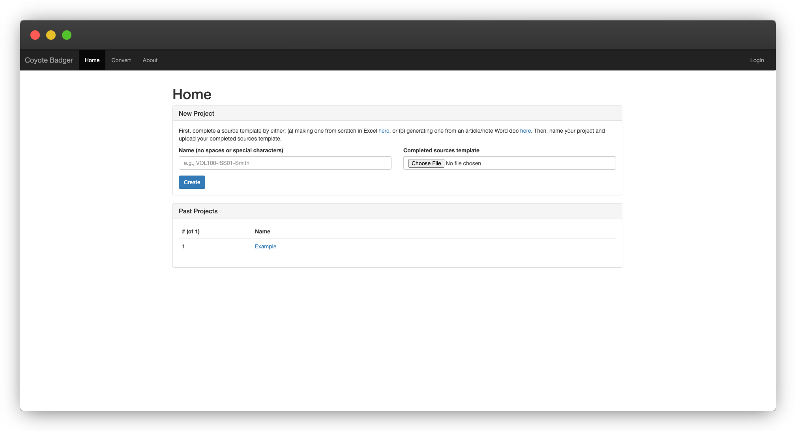

# Coyote Badger



## Table of Contents
- [Coyote Badger](#coyote-badger)
  - [Table of Contents](#table-of-contents)
  - [Getting Started](#getting-started)
  - [Install](#install)
  - [Run](#run)
      - [Mac (Intel or Apple Silicon)](#mac-intel-or-apple-silicon)
      - [Windows](#windows)
  - [Update](#update)
    - [Automatic Update](#automatic-update)
    - [Manual Update](#manual-update)
  - [Development](#development)
    - [Running from Source in Docker](#running-from-source-in-docker)
    - [Running from Source in Python](#running-from-source-in-python)
    - [Project Structure](#project-structure)
  - [Making or Requesting Changes](#making-or-requesting-changes)
  - [Videos](#videos)
  - [FAQ](#faq)
      - [How do I get notified of issues, changes, or new versions of Coyote Badger?](#how-do-i-get-notified-of-issues-changes-or-new-versions-of-coyote-badger)
      - [When I try to run the application, I get a message about not being able to connect to the Docker daemon. What do I do?](#when-i-try-to-run-the-application-i-get-a-message-about-not-being-able-to-connect-to-the-docker-daemon-what-do-i-do)
      - [Docker is taking up a lot of space on my computer. What should I do?](#docker-is-taking-up-a-lot-of-space-on-my-computer-what-should-i-do)
      - [Coyote Badger is suddenly failing on a specific type of source. What do I do?](#coyote-badger-is-suddenly-failing-on-a-specific-type-of-source-what-do-i-do)
      - [Everything is installed, it's running, but the actual Coyote Badger application isn't pulling sources properly. What do I do?](#everything-is-installed-its-running-but-the-actual-coyote-badger-application-isnt-pulling-sources-properly-what-do-i-do)
      - [I use a different login to access the source pulling websites. How do I add my custom URLs?](#i-use-a-different-login-to-access-the-source-pulling-websites-how-do-i-add-my-custom-urls)
      - [Hein login seems to always fail because my Duo isn't working. What do I do?](#hein-login-seems-to-always-fail-because-my-duo-isnt-working-what-do-i-do)
      - [My HeinOnline account was deactivated because of dowload activity. What should I do?](#my-heinonline-account-was-deactivated-because-of-dowload-activity-what-should-i-do)
      - [Why use `headless=False` with `xvfb` if you can't even see the browser?](#why-use-headlessfalse-with-xvfb-if-you-cant-even-see-the-browser)
      - [Why is git ignoring some files when I make changes?](#why-is-git-ignoring-some-files-when-i-make-changes)
      - [Something else?](#something-else)
  - [Maintenance](#maintenance)


## Getting Started
Coyote Badger is designed to take a spreadsheet of accurately bluebooked
citations and search for them. Basically, it opens and controls a web
browser in the background to do what an editor would be doing manually.

When it runs, it will pull the sources for a particular project, and output
a list of the sources that were found, along with the actual PDF files
of the sources.

To get started with Coyote Badger, first follow the
[instructions to install](#install) the software, then follow the
[instructions to run](#run) the software. Once Coyote Badger is up and running,
you may find the short [tutorial videos](#videos) helpful to understand
how it works.

## Install
To install Coyote Badger:
1. Install Docker for your operating system by selecting the appropriate
   version [here](https://docs.docker.com/get-docker/) and following the
   installation instructions.
2. Once Docker is installed, you shouldn't have to change any of the default
   preferences, but make sure you have it running (see install instructions).
3. Download the latest "Source code (zip)" of Coyote Badger from
   [here](https://github.com/alexsands/coyote-badger/releases/latest).
   Then unzip the file and move it to somewhere on your computer that you'll
   remember (e.g., `Documents` folder). You can rename the containing folder
   if you'd like.
4. That's it! Now you can [run Coyote Badger](#run).


## Run
To run Coyote Badger, follow the instructions for your particular operating
system:

#### Mac (Intel or Apple Silicon)
1. Make sure Docker is started on your computer
2. Navigate to your Coyote Badger folder
3. Right click on the `__MAC-START.command` file, then select "Open".
   Accept the warning about the unidentified developer if it asks (you
   should only have to do this step once).
4. A Terminal window will open and you'll see it printing out information. Wait
   until you see the "Coyote Badger is ready to use!" message.
   Once you see this, you can close the Terminal window. If it's your first
   time running Coyote Badger, a lot of stuff will install and this will take
   several minutes (but you shouldn't have to wait this long again!).
5. Open your browser and go to [http://localhost:3000](http://localhost:3000)
6. You should see Coyote Badger!
7. When you're done using the program, right click on the
   `__MAC-STOP.command` file in the Coyote Badger folder, then select "Open".
   Accept the warning about the unidentified developer if it asks (you
   should only have to do this step once).

#### Windows
1. Make sure Docker is started on your computer
2. Navigate to your Coyote Badger folder
3. Right click on the `__WINDOWS-START.bat` file, then select "Open".
   Accept the warning about the unidentified developer if it asks (you
   should only have to do this step once).
4. A Command Prompt window will open and you'll see it printing out information.
   Wait until you see the "Coyote Badger is ready to use!" message.
   Once you see this, you can close the Command Prompt window. If it's your
   first time running Coyote Badger, a lot of stuff will install and this will
   take several minutes (but you shouldn't have to wait this long again!).
5. Open your browser and go to [http://localhost:3000](http://localhost:3000)
6. You should see Coyote Badger!
7. When you're done using the program, right click on the
   `__WINDOWS-STOP.bat` file in the Coyote Badger folder, then select "Open".
   Accept the warning about the unidentified developer if it asks (you
   should only have to do this step once).


## Update
Please make sure to update to the newest version of Coyote Badger when it is
released. The content and layout of these websites changes somewhat regularly
so if you're experiencing issues, it may get fixed in a future release. You
can update your Coyote Badger software manually or automatically
(starting with version `2.2.3`). Automatic updates will save your `_projects`
folder and your custom variables—you do not need to back these up yourself.

### Automatic Update
1. Open the `__MAC-UPDATE.command` or `__WINDOWS-UPDATE.bat` file.
2. Press any key on your keyboard when prompted.
3. Wait for the update to complete.

### Manual Update
1. Stop Coyote Badger using the `__MAC-STOP.command` or `__WINDOWS-STOP.bat`
   files.
2. Copy the `_projects` folder if you want to save your previous projects.
3. Copy the `settings.custom.urls` file if you created one to use custom login URLs.
4. Delete your Coyote Badger folder.
5. Download the latest "Source code (zip)" of Coyote Badger from
   [here](https://github.com/alexsands/coyote-badger/releases/latest).
   Then unzip the file and move it to somewhere on your computer that you'll
   remember (e.g., `Documents` folder). You can rename the containing folder
   if you'd like.
6. Restore your `_projects` folder if you backed it up in step 2.
7. Restore your `settings.custom.urls` file if you backed it up in step 3.
8. That's it! Now you can [run Coyote Badger](#run).


## Development
Coyote Badger uses Flask as the web server and Microsoft Playwright as the
automated browser controler.

### Running from Source in Docker
1. Follow the [Run](#run) instructions
2. On the `Watch Live` page you can toggle `View Only` in the VNC settings
to interact with the browser, like so.

### Running from Source in Python
Sometimes it can be easier to run Coyote Badger directly from source with
Python. To do so:
1. Make sure `pyenv` and `pyenv-virtualenv` are installed on your computer.
2. Create a virtual environment using python@3.9.2:
```sh
pyenv install 3.9.2
pyenv virtualenv 3.9.2 coyote-badger
pyenv activate coyote-badger
pip install --upgrade pip==22.0.3
```
3. Inside the project root install the project dependencies with:
```sh
pip install -r requirements.txt
playwright install chromium firefox
playwright install-deps chromium firefox
```
4. Now (and in the future) you can run the project with:
```sh
pyenv activate coyote-badger
FLASK_ENV=development python -m coyote_badger.app
```

### Project Structure
The project is generally structured as follows:
1. `/_projects`: holds the project data and is mounted to the Docker container
   as a volume.
2. `/coyote_badger/extensions`: these are the Chrome extensions that get added
   to the browser instance. They are slightly modified, with the description
   of the changes in the `README.md` in that directory.
3. `/coyote_badger/static`: holds the static files. In this case it's just the
   sources template file `Soruces.xlsx`.
4. `/coyote_badger/templates`: the frontend Jinja files for Flask.
5. `/coyote_badger/usr`: a user data folder for the Chromium browser instance.
6. `/coyote_badger/app.py`: the main routes and app logic for Flask.
7. `/coyote_badger/puller.py`: the main file for the web scraper and pulling
   sources. If Hein, Westlaw, or SSRN ever changes, this is where you should
   start.
8. `/coyote_badger/converter.py`: the main logic for turning an article/note
   Word document into the source inventory Excel sheet.
9. Everything else: these files shouldn't need to change too much in the
   future. The main thing that might break is likely in `puller.py` since
   that's where all the scraping logic happens.

To make it easier to see what is happening with Playwright, you can
increase the `slow_mo` argument to something higher in
`coyote_badger.puller.Puller.create_context()`.

In the event Hein, Westlaw, or SSRN ever changes their website, the logic for
actually pulling sources on the web is in `coyote_badger.puller.Puller.pull()`.
You can also contact me directly, just open an
[issue](https://github.com/alexsands/coyote-badger/issues), and I will get
an email about it. I'll happily take a look and try to help.

**Note:** As of 3/27/2021, it is not possible to download
Original Image files from Westlaw due to
[a bug in Chrome](https://bugs.chromium.org/p/chromium/issues/detail?id=761295)
that prevents the browser from being able to load PDF content-types in
`headless=False` mode. As a workaround, we use Firefox in `headless=False`
mode to grab sources from Hein, Westlaw, and SSRN. Unfortunately, Playwright
[does not support loading extensions in Firefox easily](https://github.com/microsoft/playwright/issues/2644),
so now we have to use a mix of Chrome (to load extensions for clean website
screenshots) and Firefox (to pull Hein, Westlaw, SSRN). Eventually, when either
issue is resolved, the code can be simplified by just using one browser.


## Making or Requesting Changes

If the project stops working as expected, please open up an
[issue](https://github.com/alexsands/coyote-badger/issues) with details on what
is failing. I will get an email about it and happily take a look. If you're
familiar with programming and would like to try fixing it yourself, you can
(1) open a pull request with your fix or (2) just upload the file/changes
you think should be made on the issue itself.


## Videos
- [Starting & Stopping](https://youtu.be/Pzyfdr_b198)
- [Creating a Source Inventory Template](https://youtu.be/p2cW8tUTOHU)
- [Pulling Sources](https://youtu.be/ypmY4Hfn5Rg)


## FAQ
#### How do I get notified of issues, changes, or new versions of Coyote Badger?

First, create a GitHub account. Then, at the top right of the [Coyote Badger
project page](https://github.com/alexsands/coyote-badger) click
`Watch` → `All Activity` to receive emails about issues.


#### When I try to run the application, I get a message about not being able to connect to the Docker daemon. What do I do?

Make sure you open the Docker application and click Start before trying
to run Coyote Badger. You may need to do this after you restart your computer
if Docker does not start automatically.


#### Docker is taking up a lot of space on my computer. What should I do?

Open Terminal or Command Prompt on your computer and type:
```sh
docker system prune -a -f
```
This will remove all unused Docker images (not just dangling ones), and when it
is finished it will show you the amount of reclaimed space. Next time you run
Coyote Badger, you will have to wait for all the Dockerfile steps to complete
again.


#### Coyote Badger is suddenly failing on a specific type of source. What do I do?

First, try to figure out why it's failing by opening the
[Watch Live](http://localhost:3001) page while Coyote Badger is running.
Is there an unexpected page? What about a change to the way Hein, Westlaw,
or SSRN looks?

If it's something you could fix by manually clicking on the page, you can
open the VNC toolbar on the left hand side, then click the gear icon, then
turn off `View Only`. Then, simply click on the browser page whenever you
need to (only do this if you are sure of what you're doing!).

If it's not something you could fix easily, open up an
[issue](https://github.com/alexsands/coyote-badger/issues).


#### Everything is installed, it's running, but the actual Coyote Badger application isn't pulling sources properly. What do I do?

It's likely that Hein, Westlaw, or SSRN changed their website code and it
broke the automated puller. If you are familiar with programming, you can try
to fix this on your own with the [Development](#development) instructions and
then make an issue/pull request on GitHub. Otherwise, please read the
[Making or Requesting Changes](#making-or-requesting-changes) section.


#### I use a different login to access the source pulling websites. How do I add my custom URLs?

Coyote Badger logs you in to different source pulling sites to gather sources
using your account credentials. The program contains school-dependent URLs for
source pull websites. By default, it is set up to work with The University of
Texas School of Law's login system, so you will need to change these values
if you are running Coyote Badger from somewhere else.

To change these values, duplicate the `settings.default.urls` file in the root
folder (keep it in the same file). Rename the duplicate to `settings.custom.urls`
(note, the file should start with a period, exactly as shown). Then, open up
your duplicated file, modify the values, and save the file. On the next start
up of Coyote Badger, it will use your new values.

When you install a new version of Coyote Badger, just drop your
`settings.custom.urls` file into the new version.


#### Hein login seems to always fail because my Duo isn't working. What do I do?

The program works by attempting to log you in (using the username and password
you provide) to Hein, Westlaw, and SSRN in the background. To do so, Hein
may use Duo for two-factor authentication when you log in with your university
or organization email address. In order for the program to pass this step, you
must set your Duo two-factor authentication settings to use "Push Notifications"
by default. If you use text message codes the program has no way of entering
the pin while its running in the background (since it can't access your text
messages). You can change this preference to use "Push Notifications" by
default on your organization's Duo settings page. You'll also need to download
the Duo smartphone app.


#### My HeinOnline account was deactivated because of dowload activity. What should I do?

While we've never had this happen to date, it's possible that Hein could
deactivate your account if it suspects unusual behavior (downloading a lot
of sources automatically). There is a human detection page that Coyote Badger
automatically clicks through to verify you're a human, but if you need to
contact Hein, the support information shown on this page is:
- [holsupport@wshein.com](mailto:holsupport@wshein.com)
- 800-277-6995 (phone support is available Monday - Friday 8:30am - 6:00pm ET)


#### Why use `headless=False` with `xvfb` if you can't even see the browser?

The program uses a few Chrome extensions to block ads and paywalls,
which unfortunately do not work in headless Chrome. The Chrome team does
not presently have this on their radar for development.


#### Why is git ignoring some files when I make changes?

The `_projects/Example` folder is being ignored so that it can be run as a
test set, without pushing new pull results to GitHub on each commit. It's a bit
deceiving though, because this doesn't happen in the `.gitignore` file. Instead,
these files are ignored via:
```sh
git update-index --skip-worktree <file>
```
To show which files are ignored, run:
```sh
git ls-files -v . | grep ^S
```


#### Something else?

Open up an [issue](https://github.com/alexsands/coyote-badger/issues) with your
question, and I will get an email about it. I'll happily take a look and try
to help.


## Maintenance
This code was written by Alex Sands and Warner Scott. Both authors, as well
the current research editor, have access to this repository and will receive
emails when new issues are submitted. If you'd like to improve this code,
please submit a PR rather than making changes offline. Keep this source
up to date!
